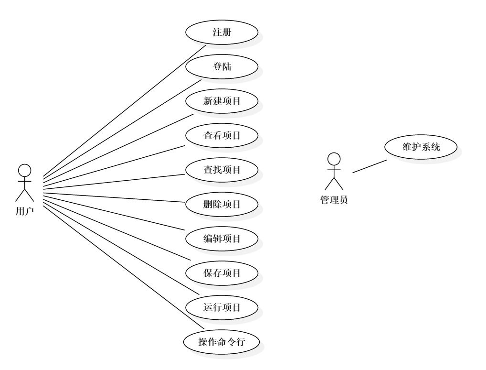
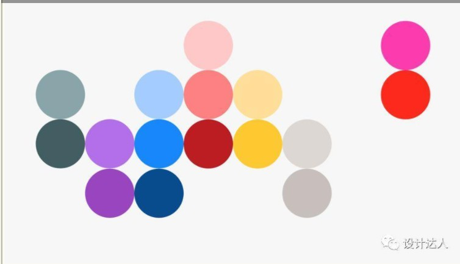

# 网站功能总述
该网站能够帮助人们完成在线项目代码编辑，并提供一定数量的项目的保存功能。具体功能设计如下：
* 主页
  1. 登陆
  2. 注册
  3. 产品介绍/演示
* 个人主页
  1. 新建项目
  2. 已保存项目的展示
  3. 删除项目
  4. 回收站
  5. 个人信息的展示
  6. 搜索功能
  7. 退出登陆
* 代码编辑页
  1. 树形项目文件结构图
  2. 代码编辑
  3. 代码保存
  4. 代码运行
  5. 命令行
  6. 常用命令展示
  7. 个人信息展示
  8. 退出登陆
* 个人信息页（待实现）
  1. 编辑个人信息
# 用例图

# 网站交互demo
[点击查看](https://modao.cc/app/IG5XNmFhGgMkHI0iHTLkNl2eQy9ZDks)
(密码为：123)
# 网站主题设计
## 颜色
### 主页
* 基调： 蓝色/灰色系
### 代码编辑页
* 编辑区、常用命令展示区、terminal区 #1E1E1E
* 树形项目文件视图区背景 #252526
* 其他区域 #333333
* 文字 #CCCCCC
* 用户信息显示 #22527B
### 个人主页
* 蓝色/灰色/红色系 

### 个人信息页
* 同个人主页
## 网页布局
### 主页
参考以下网站：
* http://runjs.cn/code
* https://ide.coding.net
* https://codesandbox.io
### 代码编辑页
参考以下网站：
* http://runjs.cn/code
* https://ide.coding.net
* https://codesandbox.io
### 个人主页
参考以下网站：
* https://shimo.im
### 个人信息页
待设计
## 页面展示
待完成
# 网站交互逻辑设计